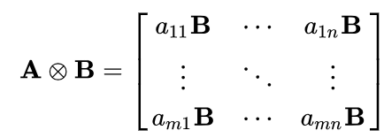
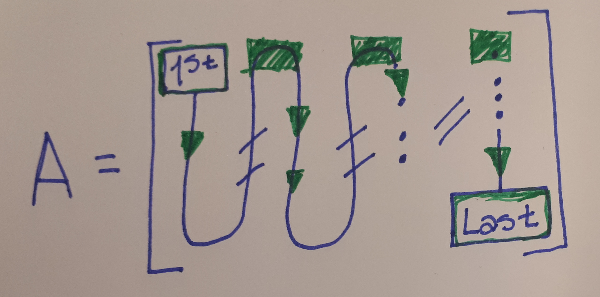
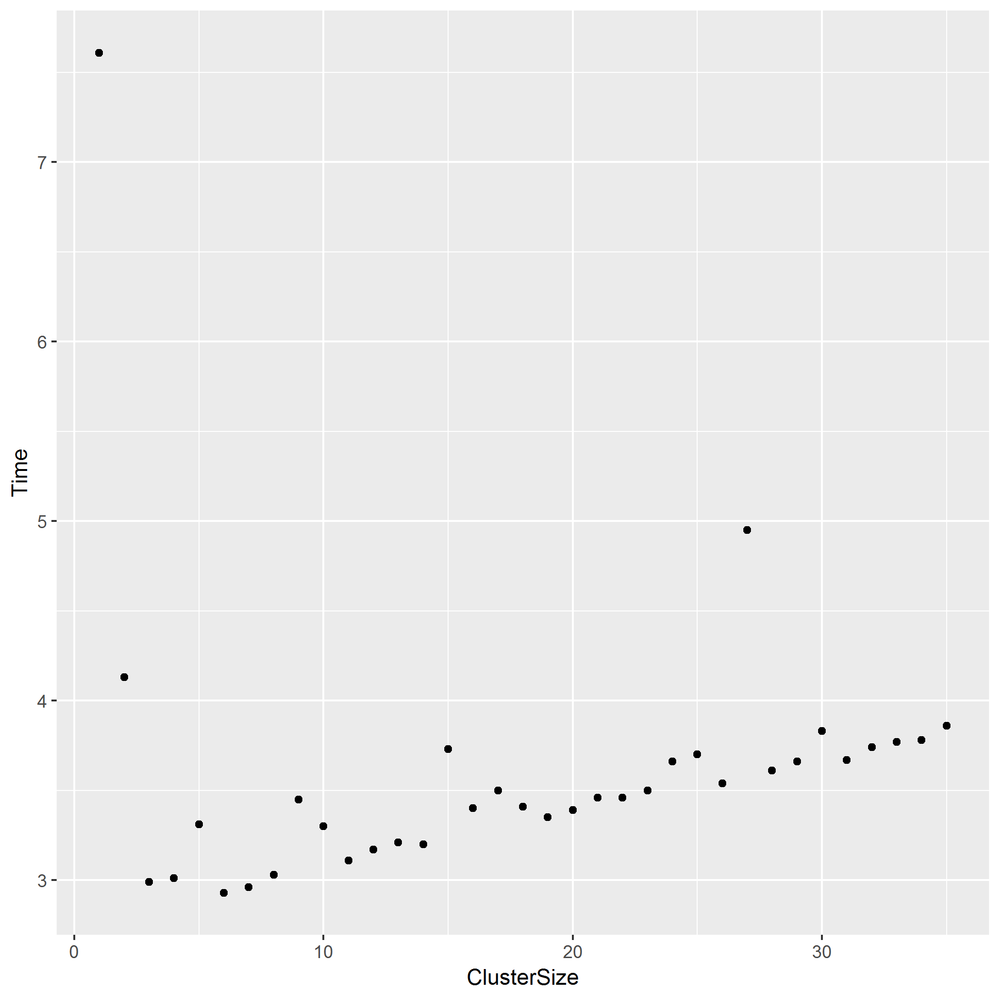
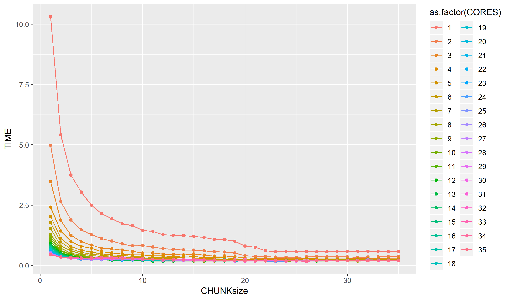
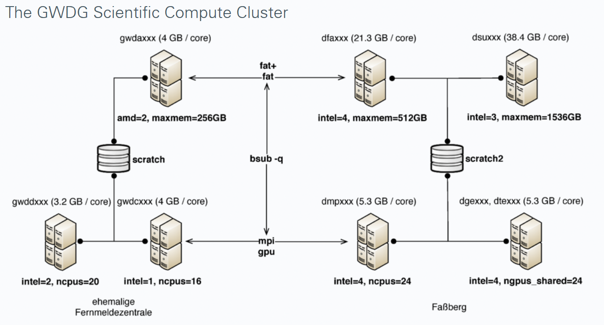
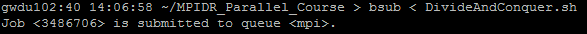
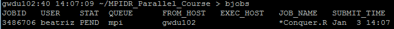
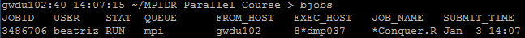
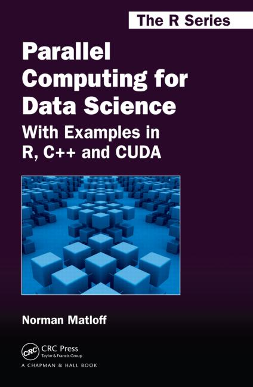

```{r setup, echo = FALSE, include=FALSE}
knitr::opts_chunk$set(
  collapse = TRUE,
  comment = "#>"#,
  # fig.path = "fig/README-",
  # echo = TRUE, fig.height = 1, fig.width = 6
)

```

# 1. First steps for parallelizing in R

```{r,echo=FALSE}
library(ggplot2)
```


## The basics

It is well known that when we are using $R$ we always have to avoid $for$ loops. Due to the calls that $R$ does to $C$ functions, therefore it is better to vectorice everything.

```{r}

rm(list=ls())
gc()

len<-5000000

a<-runif(len)
b<-runif(len)

c1=0

system.time({
  for(i in 1:length(a)){
    c1<-a[i]*b[i]+c1
  }
})['elapsed']

system.time({c2<-a%*%b})['elapsed']

```

But... what should we do when the problem we are facing needs a loop? There are two options:

1. Write the loop and wait.(*Easy way*)
2. Paralellize. (*Fun way*)

Imagine we want to do the Kronecker Product of $A \otimes B$, that means:

{width=300px}

#### Easy way


**Memory access:** It is important to know the way $R$ stores matrices, i.e., by row or by column. In the specific case of $R$ all the matrices are store by column, given that $R$ is an statistical software where the columns almost always represent variable names. This is crucial due to each variable created in R has an ID number, so the compiler or the interpreter will assign specific addresses in memory at which every element of the variables (e.g. vector, matrices, data frames, lists,...) will be stored. Given that this addresses are consecutive, it will always decreases the memory access time if we call them in a consecutive way. 

{width=300px}

```{r}

(A<-matrix(runif(9),nrow = 3,ncol = 3))

for(i in 1:length(A))
  print(paste(i,A[i]))

```


For solving with a loop this basic knowledge can help to increase the pace of the algorithm.

```{r}

rm(list=ls())
gc()

row=100
col=100

A<<-matrix(runif(row*col),nrow = row,ncol = col)
B<<-matrix(runif(row*col),nrow = row,ncol = col)

CR<-matrix(0,nrow = row^2,ncol = col^2)
CC<-matrix(0,nrow = row^2,ncol = col^2)


### By row
system.time({
  for (i in 1:row){
    for(j in 1:col){
      CR[((i-1)*row+1):(i*row),((j-1)*col+1):(j*col)]<-A[row*(j-1)+i]*B
    }
  }
})['elapsed']


### By column
system.time({
  for(j in 1:col){
    for (i in 1:row){
      CC[((i-1)*row+1):(i*row),((j-1)*col+1):(j*col)]<-A[row*(j-1)+i]*B
    }
  }
})['elapsed']

sum(CC-CR)

```

#### Fun way

There are several packages for parallelizing:

* doParallel
* Parallel
* snow
* multicore

Some of those packages are require by the others, so lets start with **doParallel**. Once we open this package in our session it will require **parallel** that will automatically open the rest.

The easiest way to parallelize the loop above is using the package **foreach** in conjunction with **doParallel**. For this it's necessary to call the *registerParallel* function.


```{r}

library(doParallel)

(no_cores<-detectCores()-1)

registerDoParallel()

getDoParWorkers()


```

Now we proceed to parallelize:

```{r}

system.time({
  C<-foreach(A2=A,.combine = 'cbind',.packages = c('foreach'))%dopar%{
        foreach(i=1:length(A2),.combine = 'rbind')%do%{
            A2[i]*B
        }
      }
})['elapsed']

sum(CC-C)


```

Anytime we initialize the cores using **registerDoParallel** there is no need to close the connections, they will be stopped automatically once the program detects they aren't used anymore.


### Life is always a tradeoff

You might be wondering why we are not using more than 3 cores. Let's do it!

First, we need to introduce some new functions:

* **makeCluster**: this function will initialize all the cores or clusters that we require.
* **stopCluster**: this function will stop and release the cores that we have initialized.

```{r,eval=FALSE}

Times<-rep(0,no_cores)

for(h in 1:no_cores){
  cls<-makeCluster(h)
  registerDoParallel(cls)
  Times[h]<-system.time({
      foreach(A2=A,.combine = 'cbind',.packages = c('foreach'))%dopar%{
        foreach(i=1:length(A2),.combine = 'rbind')%do%{
            A2[i]*B
        }
      }
  })['elapsed']
  stopCluster(cls)
}


```

```{r,eval=FALSE,echo=FALSE}

library(ggplot2)

Times<-data.frame(Time=Times,ClusterSize=1:length(Times))

ggplot(Times,aes(ClusterSize,Time))+geom_point()

ggsave('Time_graph.png')

```


{width=500px}

Given that we are sharing memory, i.e., in every iteration we are calling $B$, the way $R$ in Windows handles this is making the different cores wait until the others finish using $B$. Therefore, more cores not always means less time.


## Divide and Conquer - All Possible Regressions

Now that we are almost masters of the paralelization it is time to handle more complicated problems. The next example was extracted from Matloff, 2015.

Suppose we have $n$ observations and $p$ predictor variables, we are going to use *the all possible regressions* method for selecting the variables. Therefore, we need to fit regression models to each possible subset of the $p$ predictors, and choose those that return the largest $R^2$.

There are $2^p$ possible models, this means that we are dealing with the most exhaustive computer problem.


```{r}

# ---- General Functions ----
# Generate all nonempty subsets of 1..p of size <=k; returns an R list,
# one element per predictor set, in the form of a vector of indices
genallcombs<-function(p,k){
  allcombs<-list()
  for(i in 1:k){
    tmp<-combn(p,i) ####
    allcombs<-c(allcombs,matrixtolist(tmp,rc=2))
  }
  return(allcombs)
}

# extracts rows (rc=1) or columns (rc=2) of a matrix, producing a list
matrixtolist<-function(rc,m){
  if(rc==1){
    Map(function(rownum) m[rownum,], 1:nrow(m))
  }else{
    Map(function(colnum) m[,colnum], 1:ncol(m))
  }
}


```


```{r}


# ---- Parallel functions ----
snowapr<-function(cls, x, y, k, reverse=FALSE, dyn=FALSE, chunksize=1){
  require(parallel)
  p<-ncol(x)
  # generate predictor subsets, an R list, 1 element for each predictor subset
  allcombs<-genallcombs(p,k)
  ncombs<-length(allcombs)
  clusterExport(cls, 'do1pset')
  # set up task indices
  tasks<-if(!reverse)
    seq(1, ncombs, chunksize) else
      seq(ncombs, 1, -chunksize)
  if(!dyn){
    out<-clusterApply(cls, tasks, dochunk, x, y, allcombs, chunksize)
  }else{
    out<-clusterApplyLB(cls, tasks, dochunk, x, y, allcombs, chunksize)
  }
  # each element of out consists of rows showing adj. R2 and the indices
  # of the predictor set that produced it; combine all those vectors 
  # into a matrix
  Reduce(rbind,out)
}

# Process all the predictor sets in the allcombs chunk whose
# first index is psetsstarts
dochunk<-function(psetsstarts, x, y, allcombs, chunksize){
  ncombs<-length(allcombs)
  lasttask<-min(psetsstarts+chunksize-1, ncombs)
  t(sapply(allcombs[psetsstarts:lasttask], do1pset, x, y))
}

# Find the adjusted R-squared values for the given predictor
# set onepset; return value will be the adj R2 value, followed
# by the predictor set indices, with 0s as filler- for
# convenience, all vectors returned by calls to do1pset()
# have lenght k+1; e.g. for k=4, (0.28, 1, 3, 0, 0) would
# mean the predictor set consisting of columns 1 and 3 of x,
# with an R2 value of 0.28
do1pset<-function(onepset, x, y){
  slm<-summary(lm(y~x[,onepset]))
  n0s<-ncol(x)-length(onepset)
  c(slm$adj.r.squared, onepset, rep(0,n0s))
}


```


```{r,eval=FALSE}

# Applying Algorithm
n=1000
p=8
k=6
x<<-matrix(rnorm(n*p),ncol=p)
y<<-x%*%c(rep(0.5,p))+rnorm(n)

ncor<-35

times<-data.frame(CORES=rep(1:ncor,each=ncor))
times$CHUNKsize<-rep(1:ncor,times=ncor)
times$TIME<-rep(0,nrow(times))

for(i in 1:nrow(times)){
    cls<-makeCluster(times$CORES[i])
    times$TIME[i]=(system.time(Data<-snowapr(cls,x,y,k,
                                  reverse=FALSE,dyn=TRUE,chunksize=times$CHUNKsize[i])))['elapsed']
    stopCluster(cls)
}


```

```{r, echo=FALSE}
# Table<-data.frame(rbind(times[which.max(times$TIME),],times[which.min(times$TIME),]))
# 
# write.csv(Table,'TableDandC.csv',row.names = FALSE)

Table<-read.csv('TableDandC.csv')

Table2<-Table[c(which.min(Table$TIME),which.max(Table$TIME)),]

rownames(Table2)<-c('Minimum','Maximum')

knitr::kable(Table2)

```


```{r,eval=FALSE, echo=FALSE}

# p<-ggplot(Table,aes(CHUNKsize,TIME,color=as.factor(CORES)))+
#   geom_line()+geom_point()
# 
# ggsave('TimesPlot.png',p)

```

{width=500px}


# 2. Submitting R scripts into the cluster

From now on the operating system will be Linux. Linux and Windows have significant differences from each other, not only in the graphic user interface, but also in their architectural level. One of the main differences is that Windows doesn't fork and Linux does. That means that Linux make copies of the needed variables in all the cores, instead of forcing the cores to queue and wait for using the share variables.

So, lets check what happens if instead of **makeCluster** we use **makeForkCluster** (attention, this function is only available for Linux) for the Kronecker product.

```{r,eval=FALSE}

Times<-rep(0,no_cores)

for(h in 1:no_cores){
  cls<-makeForkCluster(h)
  registerDoParallel(cls)
  Times[h]<-system.time({
      foreach(A2=A,.combine = 'cbind',.packages = c('doParallel'))%dopar%{
        foreach(i=1:length(A2),.combine = 'rbind')%do%{
            A2[i]*B
        }
      }
  })['elapsed']
  stopCluster(cls)
}


```

## The basics

First, open $R$ in the terminal, install the packages and close $R$. When the packages are installed for the first time, it takes about 10 minutes to download everything.

```{r,eval=FALSE}

> R

install.packages("Rmpi", dependencies=TRUE, configure.args=c("--with-mpi=/cm/shared/apps/openmpi/gcc/64/1.10.7"))
install.packages("doParallel", dependencies=TRUE) ## CRAN Mirror 34 (Germany)


library(doParallel)

(no_cores<-detectCores()-1)

registerDoParallel()

getDoParWorkers()

q()

```

For running and R code in terminal, without opening $R$, just write **Rscript** followed by the name of your $R$ file.


```{r, eval=FALSE}

> Rscript DivideAndConquer.R

```

## How does the cluster work?

For submitting jobs to the cluster it is necessary to create a **shell file** using a **batch system** through LSF commands. So, the GWDG cluster is operated by the LSF platform, which is operated by shell commands on the frontends. The **frontends** are special nodes (gwdu101, gwudu102, and gwdu103) provided to interact with the cluster via shell commands.

The batch system distributes the processes across job slots, and matches the job's requirements to the capabilities of the job slots. Once sufficient suitable job slots are found, the job is started. LSF considers jobs to be started in the order of their priority.


It is also necessary to know how the cluster is structured:


```{r, out.width='100%', fig.align='right', fig.cap='source: https://info.gwdg.de/dokuwiki/doku.php?id=en:services:application_services:high_performance_computing:running_jobs', echo=FALSE}

```


### Basic options of **disk space**

* /scratch: this is the shared scratch space, available on *gwda, gwdc*, and *gwdd* nodes and on the frontends *gwdu101* and *gwdu102*. For being sure of having a node with access to shared */scratch* the command **-R scratch** must be written in the shell file.

* /scratch2: this is the shared scratch space, available on *dfa, dsu, dge*, and *dmp* nodes, and on the frontend *gwdu103*. For being sure of having a node with access to shared */scratch2* the command **-R scratch2** must be written in the shell file.

* $HOME: our home directory is available everywhere, permanent, and comes with backup, but it is comparatively slow.

### Basic queue *mpi*

**mpi** is the general purpose queue, usable for serial and SMP jobs with up to 20 tasks, but it is especially well suited for large MPI jobs. Up to 1024 cores can be used in a single MPI job, and the maximum is 48 hours. This is specified in the shell file through the command **-q mpi**.

Some extra parameters for this queue are:

* -long: the maximum run time is increased to 120 hours. Job slot availability is limited, and long waiting times are expected.

* -short: the maximum run time is decreased to two hours. In turn the queue has a higher base priority, but it also has limited job slot availability. That means that as long as only few jobs are submitted to the *-short* queues they will have minimal waiting times.

### Specifying node properties with *-R*

**-R** runs the job on a host that meets the specified resource requirements. Some of its basic parameters are:

* span[hosts=1]: this puts all processes on one host.
* span[ptile=< x >]: *x* denotes the exact number of job slots to be used on each host. If the total process number is not divisible by *x*.
* scratch(2): the node must have access to *scratch(2)*.

### Last but not less important parameters

- -N: sends the job report to you by email when the job finishes.
- -u: sends the email to the specified email destination.
- -W: sets the runtime limit of the job.
- -o: appends the standard output of the job to the specified file path.
- -n: submits a parallel job and specifies the number of tasks in the job.
- -a: this option denotes a wrapper script required to run SMP or MPI jobs. The most important wrappers are^[https://wiki.uiowa.edu/display/hpcdocs/Advanced+Job+Submission]:
    - Shared Memory (**openmp**). This is a type of parallel job that runs multiple threads or processes on a single multi-core machine. OpenMP programs are a type of shared memory parallel program.
    - Distributed Memory (**intelmpi**). This type of parallel job runs multiple processes over multiple processors with communication between them. This can be on a single machine but is typically thought of as going across multiple machines. There are several methods of achieving this via a message passing protocol but the most common, by far, is MPI (Message Passing Interface).
    - Hybrid Shared/Distributed Memory (**openmpi**). This type of parallel job uses distributed memory parallelism across compute nodes, and shared memory parallelism within each compute node. There are several methods for achieving this but the most common is OpenMP/MPI.
    


### The **bsub** command: Submitting jobs to the cluster

**bsub** submits information regarding your job to the batch system. Instead of writing a large *bsub* command in the terminal, we will create a shell file specifying all the *bsub* requiremnts.

The shell files can be created through either the linux terminal using the editor *nano* or Notepad++ in Windows. 

## Non-parallel jobs

For creating the shell file we will use the Linux text editor **nano**.

```{r, eval=FALSE}

> nano NameShell.sh

------------------------
#!/bin/sh 
#BSUB -N 
#BSUB -u <YourEmail>
#BSUB -q mpi 
#BSUB -W <max runtime in hh:mm>
#BSUB -o NameOutput.%J.txt 
 
R CMD BATCH NameCode.R
--------------------------

```

For submiting the job the command is:

```{r, eval=FALSE}
> bsub < NameShell.sh
```


## Parallel jobs

```{r, eval=FALSE}

> nano NameShell.sh

------------------------
#!/bin/sh 
#BSUB -N 
#BSUB -u <YourEmail>
#BSUB -q mpi 
#BSUB -W <max runtime in hh:mm>
#BSUB -o NameOutput.%J.txt 
#BSUB -n <min>,<max> or <exact number> 
#BSUB -a openmp 
#BSUB -R span[hosts=1] 
 
R CMD BATCH NameCode.R
--------------------------

```


```{r, eval=FALSE}
> bsub < NameShell.sh
```

So, for submiting our job the shell file would look like the next one:

```{r, eval=FALSE}

> nano DivideAndConquer.sh

------------------------
#!/bin/sh 
#BSUB -N 
#BSUB -u gil@demogr.mpg.de
#BSUB -q mpi 
#BSUB -W 00:30
#BSUB -o DivideAndConquer.%J.txt 
#BSUB -n 8 
#BSUB -a openmp 
#BSUB -R span[hosts=1] 
 
R CMD BATCH DivideAndConquer.R
--------------------------

```


```{r, eval=FALSE}
> bsub < DivideAndConquer.sh
```

{width=800px}


## Other important LSF commands

* bjobs: lists currents jobs.

While not having a job slot:

{width=800px}

Once having a job slot:

{width=800px}


* bhist: lists older jobs.
* lsload: status of cluster nodes.
* bqueues: status of cluster nodes.
* bhpart: shows current user priorities.
* bkill <jobid>: stops the current job.


# References

{width=200px}


https://info.gwdg.de/dokuwiki/lib/exe/fetch.php?media=en:services:scientific_compute_cluster:parallelkurs.pdf


